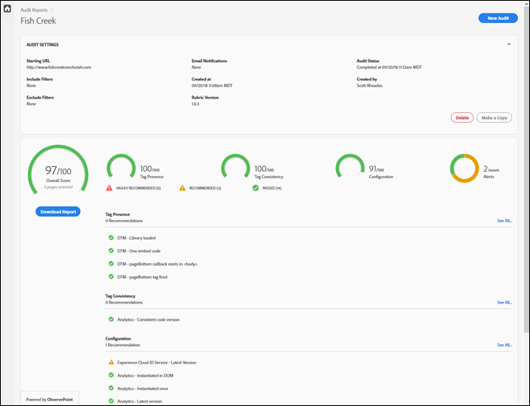

# Introduzione {#getting-started}

## Introduzione {#task-1024e94b5948413295c9698e62165a04}

<!--
This page is a placeholder for now, we need things like prerequisites, any planning that should be done before using Auditor, initial setup info--that kind of thing.
-->

La prima volta che utilizzi Auditor, devi completare e accettare l’accordo di Auditor. Auditor è stato sviluppato grazie allo sforzo congiunto tra Adobe e ObservePoint. Gli utenti di Auditor possono utilizzare funzionalità ObservePoint limitate senza costi aggiuntivi. Per utilizzare Auditor, devi acconsentire alle comunicazioni da ObservePoint.

## Esecuzione della prima scansione {#task-b211597afed343cfa238443fcf7c6041}

1. Fai clic sul pulsante del menu nell’angolo in alto a destra della barra di navigazione di Adobe Experience Cloud e fai clic su **[!UICONTROL Activation]**.

   

1. Seleziona Auditor e accetta le Condizioni d’uso.

   La pagina Auditor offre una dashboard delle scansioni precedenti, con l’opzione di eseguire una nuova scansione.

   

1. Fai clic su **[!UICONTROL New Audit]**.

   Per eseguire una nuova scansione, fai clic su **[!UICONTROL New Audit]** in alto a destra nella schermata.

   

1. Configura la scansione.

   Assegna un nome al controllo di audit, fornisci un URL iniziale e fai clic su **[!UICONTROL Run Report]**. Al termine dell’analisi riceverai una notifica e-mail.

   

   Per una descrizione di tutte le opzioni di configurazione, vedi [Creazione di un nuovo controllo di audit](../create-audit/create-new-audit.md).
1. Visualizza il rapporto.

   Quando ricevi l’e-mail che informa del completamento della scansione, fai clic sul collegamento per [visualizzare il rapporto](../reports/scorecard.md) e iniziare a comprendere le opportunità per migliorare la tua implementazione e ottenere più valore dalle soluzioni Adobe.

   Puoi anche fare clic sul nome del controllo di audit nella [pagina di Auditor](../get-started/audit-list.md) per visualizzare lo stato del controllo e il rapporto al termine del controllo.

   
